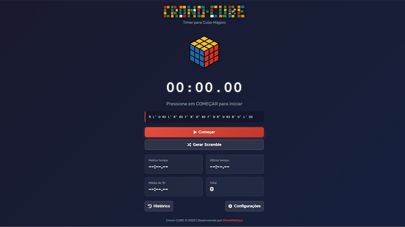
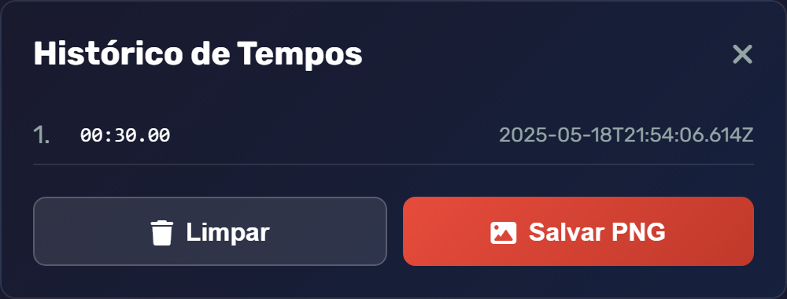

# Crono-CUBE ⏱️🎯

  
*Timer para Profissional e Iniciante para Speedcubers com estatísticas avançadas*

## ✨ Funcionalidades
- ⏱️ Timer preciso (MM:SS.MS)  
- 🎯 Contagem regressiva de 3 segundos  
- 🔀 Gerador de scrambles WCA-compatíveis  
- 📊 Estatísticas (PB, AO10, últimos tempos)  
- 🌓 Modos Claro/Escuro  
- 📸 Exportar histórico como PNG  
- 📱 Responsivo para mobile/desktop  

## 🌐 Acesso Online
Disponível em: **[https://allvesmatteus.github.io/Crono-CUBE/](https://allvesmatteus.github.io/Crono-CUBE/)**

## 🛠️ Tecnologias Utilizadas
<div align="center">
  
  
  
  
  
</div>

## 📸 Screenshots & Demonstração

### Interface Principal
| Modo Escuro | Modo Claro |
|-------------|------------|
|  |  |

### Fluxo de Uso
1. **Preparação**:  
     
   *Timer aguardando início com scramble gerado*

2. **Contagem Regressiva**:  
     
   *Animação de 3...2...1...JÁ!*

3. **Em Ação**:  
     
   *Tempo em contagem com feedback visual*

4. **Resultado**:  
     
   *Opções após parar o timer*

### Recursos Avançados
| Histórico Completo | Estatísticas | Exportação |
|--------------------|--------------|------------|
|  |  |  |

## 🚀 Como Usar
```bash
# Clone o repositório
git clone https://github.com/AllvesMatteus/Crono-CUBE.git

# Abra no navegador
cd Crono-CUBE && start index.html